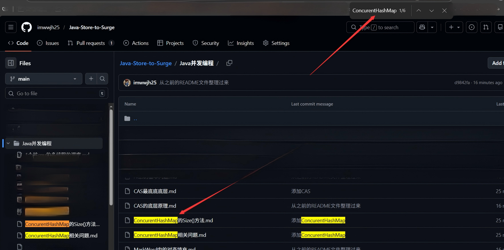

# Java-Store-to-Surge


## Tips

📕记录自己学习后端，确切来说是Java后端的一些积累和整理，主要是【问题搜集】+【AI辅助回答】+【经典问题消化整理】+【深度思考形成自己的体系】+【重复重复重复】

## Ps

1. 现在AI确实能很大程度的提效，比如遇到一个问题都省去了搜索引擎搜索的过程，直接交给AI就行，但是AI的回答有时候会有点问题，需要自己甄别。但第一个阶段是【量】的一个过程，量变才引起质变，所以很多问题都是AI生成的。
2. 对于想深入系统的学习和掌握的部分，还是要老三样【书籍，课程，动手】


## Use

1. 常见的对话式AI都可以网页直接复制，但是很多时候直接粘贴格式会乱，所以我是准备了一个专门处理【Markdown】文件格式的工具，但是将网页上的复制之后的内容之后然后用Markdown语法整体，Markdown的语法很简单，我自己就整理个[Repositiry](https://github.com/imwwjh25/AwesomeMarkdown)。
2. 对于想在网页上直接搜索直接在对应的文件夹中 ```Ctrl+F``` 搜索关键字即可




## Other

## Goals

1. 因为Repositories的目录太多并且文件数量不少，所以为了统计Repositories的文件数量和分布，并且用可视化的方式展示，所以用Python实现了一个可视化脚本，具体看[markdown_visualizer](./ShowInfoAboutRepositories/markdown_visualizer.py)
2. 为了解决每次git添加操作之后都要手动的执行Python脚本来统计文件数量，所以写了一个Git Hook脚本[pre-commit](./ShowInfoAboutRepositories/git_hooks/pre-commit)，在每次提交之前自动执行Python脚本来更新可视化结果。


## Use

- 启动监控：运行 python git_monitor.py
- 监控脚本会在后台持续运行，检测仓库中Markdown文件的变化
- 当执行 git add 或直接修改Markdown文件时，监控脚本会自动更新可视化结果
- 可视化结果保存在 output 目录中，包括柱状图和HTML报告
- 按 Ctrl+C 停止监控